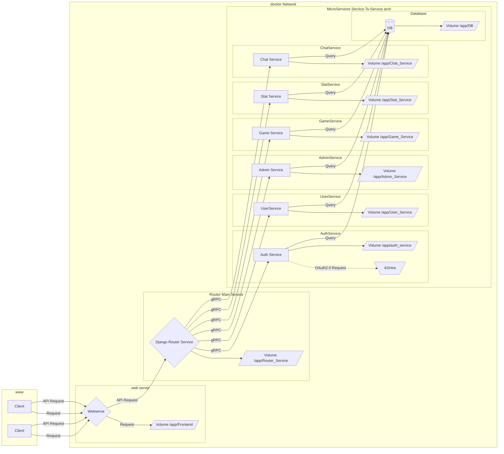

# transcendence
Der Nils, Paul und ich machen unseren 42 Abschluss

```mermaid
flowchart LR

    subgraph www
        A[Client]
        AA[Client]

    end

    subgraph docker Network
        subgraph web server
            A[Client] -->|API Request| B{Webserve}
            A[Client] -->|Request| B{Webserve}
            AA[Client] -->|API Request| B{Webserve}
            AA[Client] -->|Request| B{Webserve}
            B --> |Request|FF[/Volume /app/Frontend /]
        end

        subgraph Router Main Service
            B --> |API Request|C{Django Router Service}
            C --> T[/Volume /app/Router_Service /]
        end

        subgraph MicroServices Service-To-Service arch
            subgraph AuthService
                C -->|gRPC| D[Auth Service]
                D -->Z[/Volume /app/auth_service /]
                D -.->|OAuth2.0 Request| K[\42Intra/]
            end

            subgraph UserService
                C -->|gRPC| E[UserService]
                E -->Y[/Volume /app/User_Service /]
            end

            subgraph AdminService
                C -->|gRPC| F[Admin Service]
                F -->X[/Volume /app/Admin_Service /]
            end

            subgraph GameService
                C -->|gRPC| G[Game Service]
                G -->W[/Volume /app/Game_Service /]
            end

            subgraph StatService
                C -->|gRPC| H[Stat Service]
                H -->V[/Volume /app/Stat_Service /]
            end

            subgraph ChatService
                C -->|gRPC| I[Chat Service]
                I -->Q[/Volume /app/Chat_Service /]
            end

            subgraph Database
                D -->|Query| J[(DB)]
                E -->|Query| J[(DB)]
                F -->|Query| J[(DB)]
                G -->|Query| J[(DB)]
                H -->|Query| J[(DB)]
                I -->|Query| J[(DB)]
                J -->R[/Volume /app/DB /]
            end
        end


    end
```

```mermaid

erDiagram
    User {
        int id PK
        string name(intra_name)
        string mail
        bool isAuth
        bool blocked
        datetime created_at
        datetime updated_at
        int role_id FK
        datetime last_login
        string last_login_ip
    }

    Role {
        int id PK
        string name
    }

    Permission {
        int id PK
        string name
        string description
    }

    RolePermission {
        int role_id FK
        int permission_id FK
    }

    Auth {
        int id PK
        string token
        int user_id FK
    }

    AuthState {
        int id PK
        string state
    }

    Setting {
        int id PK
        string name
        json data
        int user_id FK
    }

    Staff {
        int id PK
        int user_id FK
        string position
    }

    Game {
        int id PK
        string state
        int points_player_a
        int points_player_b
        int player_a_id FK
        int player_b_id FK
        bool finished
        datetime created_at
        datetime updated_at
    }

    Stat {
        int id PK
        int game_id FK
        int winner_id FK
        int loser_id FK
        datetime created_at
    }

    UserStat {
        int id PK
        int user_id FK
        int stat_id FK
        bool did_win
    }

    ChatRoom {
        int id PK
        string name
        datetime created_at
        int game_id FK
    }

    ChatRoomMessage {
        int id PK
        text content
        int sender_id FK
        int chat_room_id FK
        datetime timestamp
    }

    ChatRoomUser {
        int id PK
        int user_id FK
        int chat_room_id FK
        datetime joined_at
    }

    MatchmakingQueue {
        int id PK
        int user_id FK
        int skill_level
        datetime joined_at
    }

    GameEvent {
        int id PK
        int game_id FK
        string event_type
        string event_data
        datetime timestamp
    }

    AuditLog {
        int id PK
        int staff_id FK
        string action_type
        string action_description
        datetime timestamp
    }

    Friendship {
        int id PK
        int user_id FK
        int friend_id FK
        datetime established_at
        bool accepted
    }

    Achievement {
        int id PK
        string name
        string description
        datetime created_at
    }

    UserAchievement {
        int id PK
        int user_id FK
        int achievement_id FK
        datetime unlocked_at
    }

    Notification {
        int id PK
        int user_id FK
        string message
        bool read
        datetime sent_at
    }

    Profile {
        int id PK
        int user_id FK
        string avatar_url
        string nickname
        string bio
        json additional_info
    }

%% Relationships
    MatchmakingQueue ||--|| User : belongs_to
    GameEvent ||--|| Game : belongs_to
    AuditLog ||--|| Staff : belongs_to
    Friendship ||--o{ User : belongs_to
    UserAchievement ||--|| User : belongs_to
    UserAchievement ||--|| Achievement : unlocks
    Notification ||--|| User : notified
    Profile ||--|| User : belongs_to

    Role ||--o{ User : has
    RolePermission ||--o{ Role : grants
    RolePermission ||--o{ Permission : controls
    Staff ||--|| User : belongs_to
    Auth ||--o{ User : belongs_to
    Setting }o--|| User : belongs_to
    Game }o--|| User : player_a
    Game }o--|| User : player_b
    Stat }o--|| Game : belongs_to
    Stat }o--|| User : winner
    Stat }o--|| User : loser
    UserStat }o--|| User : belongs_to
    UserStat }o--|| Stat : belongs_to
    ChatRoomMessage }o--|| ChatRoom : belongs_to
    ChatRoomMessage }o--|| User : sender
    ChatRoomUser }o--|| ChatRoom : belongs_to
    ChatRoomUser }o--|| User : belongs_to

    Stat ||--o{ User : belongs_to
    Stat ||--o{ UserStat : calculates_leaderboard

```

