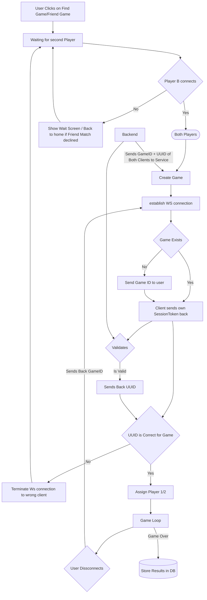

```mermaid
flowchart TD
	A[User Clicks on Find Game/Friend Game] --> B[Waiting for second Player]
	B --> C{Player B connects}
	C -->|Yes|S([Both Players])--> D[Create Game] --> WS[establish WS connection]
	C -->|No| E[Show Wait Screen / Back to home if Friend Match declined] --> B
	WS --> RGI --> |Yes|G
	RGI{Game Exists} --> |No| F[Send Game ID to user]
	F --> G[Client sends own SessionToken back]
	G --> H{UUID is Correct for Game}
	H -->|No| I[Terminate Ws connection to wrong client] --> B
	H -->|Yes|PreGame
	PreGame[Assign Player 1/2] -->K[Game Loop]
	K --> L{User Dissconnects} -->|Sends Back GameID| WS
	K --> |Game Over| M[(Store Results in DB)]
	Backend --> |Sends GameID + UUID of Both Clients to Service|D
	G --> Valid{Validates} --> |Is Valid| UID[Sends Back UUID] --> H
	Backend --> Valid
```
```
