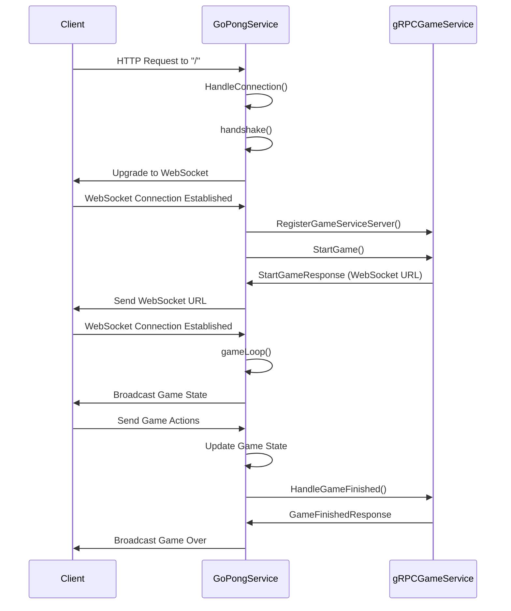

```mermaid
sequenceDiagram
    participant Client
    participant GoPongService
    participant gRPCGameService

    Client->>GoPongService: HTTP Request to "/"
    GoPongService->>GoPongService: HandleConnection()
    GoPongService->>GoPongService: handshake()
    GoPongService->>Client: Upgrade to WebSocket
    Client->>GoPongService: WebSocket Connection Established
    GoPongService->>gRPCGameService: RegisterGameServiceServer()
    GoPongService->>gRPCGameService: StartGame()
    gRPCGameService->>GoPongService: StartGameResponse (WebSocket URL)
    GoPongService->>Client: Send WebSocket URL
    Client->>GoPongService: WebSocket Connection Established
    GoPongService->>GoPongService: gameLoop()
    GoPongService->>Client: Broadcast Game State
    Client->>GoPongService: Send Game Actions
    GoPongService->>GoPongService: Update Game State
    GoPongService->>gRPCGameService: HandleGameFinished()
    gRPCGameService->>GoPongService: GameFinishedResponse
    GoPongService->>Client: Broadcast Game Over
```
