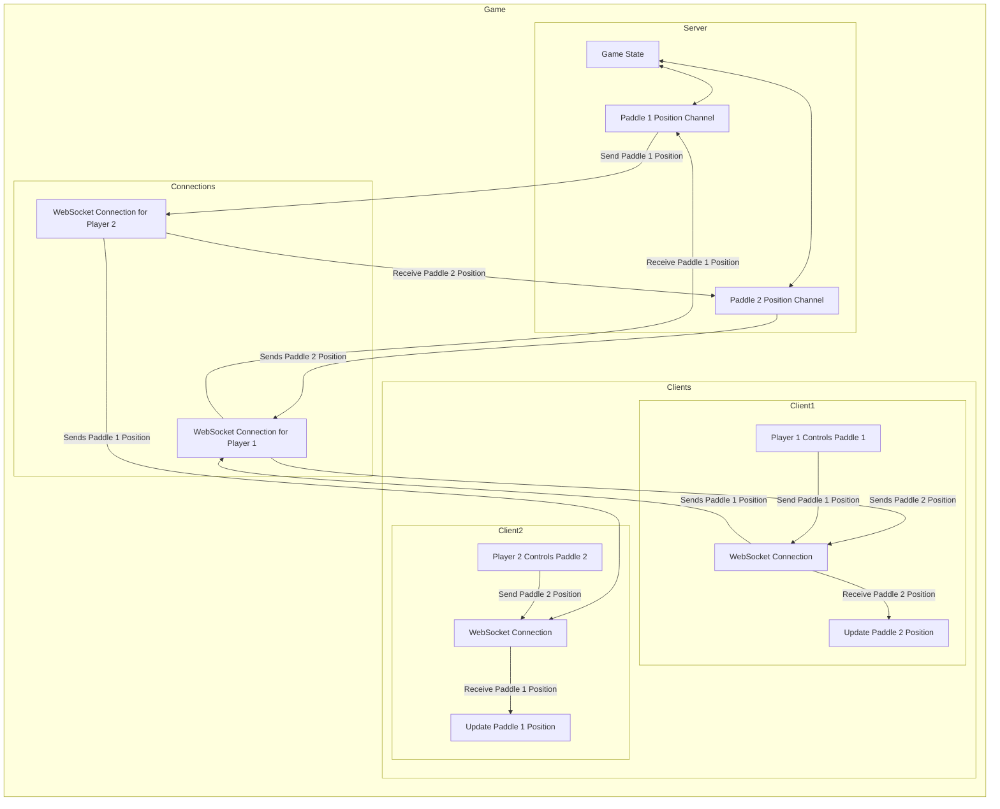

        H <--> E

```mermaid
flowchart TD
    subgraph Game
    direction TB
    Server ~~~ Connections ~~~ Clients
        subgraph Server
            direction TB
            A[Game State]
            A<-->B
            A<-->C
            direction LR
            B[Paddle 1 Position Channel]
            C[Paddle 2 Position Channel]
            B ~~~ A ~~~ C
        end
        direction TB
        B -->|Send Paddle 1 Position| F
        C -->|Sends Paddle 2 Position| E
        subgraph Connections
            direction LR
            E[WebSocket Connection for Player 1] ~~~ F[WebSocket Connection for Player 2]
        end
        direction TB
        F-->|Sends Paddle 1 Position| K
        E -->|Sends Paddle 2 Position| H
        direction BT
        H -->|Sends Paddle 1 Position| E
        E -->|Receive Paddle 1 Position| B
        F -->|Receive Paddle 2 Position| C
    direction TB
        Server ~~~ Connections ~~~ Clients
        subgraph Clients
            direction LR
            Client1 ~~~ Client2
            subgraph Client1
                G[Player 1 Controls Paddle 1]-->|Send Paddle 1 Position| H
                H[WebSocket Connection]-->|Receive Paddle 2 Position| I
                I[Update Paddle 2 Position]
            end
            subgraph Client2
                direction RL
                J[Player 2 Controls Paddle 2]-->|Send Paddle 2 Position| K
                K[WebSocket Connection]-->|Receive Paddle 1 Position| L
                L[Update Paddle 1 Position]
            end
        end
    direction LR
    Client1 ~~~ Connections ~~~Client2
    direction TB
    end
```
