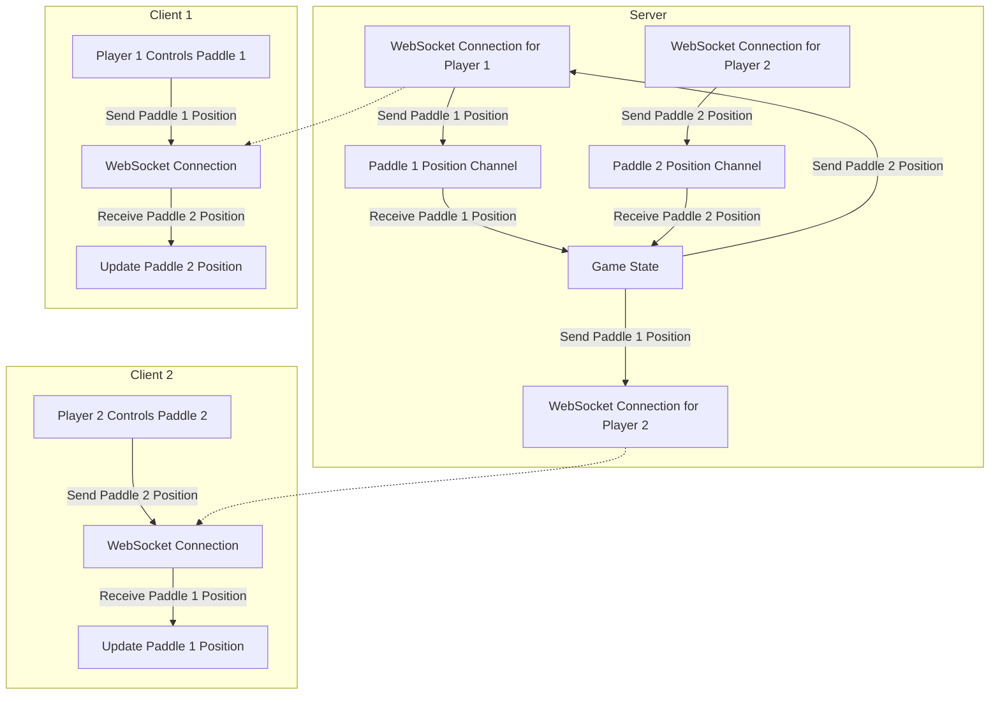

```mermaid
flowchart TD
    subgraph Server
        direction TB
        A[WebSocket Connection for Player 1] -->|Send Paddle 1 Position| B[Paddle 1 Position Channel]
        B -->|Receive Paddle 1 Position| C[Game State]
        C -->|Send Paddle 1 Position| D[WebSocket Connection for Player 2]

        E[WebSocket Connection for Player 2] -->|Send Paddle 2 Position| F[Paddle 2 Position Channel]
        F -->|Receive Paddle 2 Position| C
        C -->|Send Paddle 2 Position| A
    end

    subgraph Client 1
        direction TB
        G[Player 1 Controls Paddle 1] -->|Send Paddle 1 Position| H[WebSocket Connection]
        H -->|Receive Paddle 2 Position| I[Update Paddle 2 Position]
    end

    subgraph Client 2
        direction TB
        J[Player 2 Controls Paddle 2] -->|Send Paddle 2 Position| K[WebSocket Connection]
        K -->|Receive Paddle 1 Position| L[Update Paddle 1 Position]
    end

    A -.-> H
    D -.-> K
```
